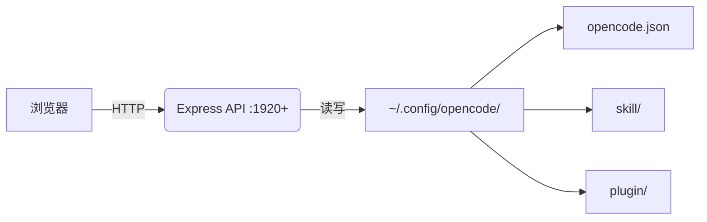

# 中文文档

<p align="center">
  <a href="README.md"><strong>English</strong></a> | <strong>简体中文</strong>
</p>

<p align="center">OpenCode 配置本地管理 GUI。切换 MCP 服务器、编辑技能、管理插件、处理认证 - 无需手动编辑 JSON。</p>

---

### 快速开始

#### 方式 1: 公共站点 + 本地后端 (推荐)

```bash
npm install -g opencode-studio-server
```

访问 [opencode.micr.dev](https://opencode.micr.dev) 并在侧边栏点击 "Launch Backend"。

#### 方式 2: 完全本地运行

**Windows**
```batch
quickstart.bat
```

**macOS / Linux**
```bash
chmod +x quickstart.sh && ./quickstart.sh
```

打开 http://localhost:1080

---

### 功能特性

- **MCP 管理器**: 开关服务器、粘贴 npx 命令添加新服务器、删除未使用的配置
- **配置环境 (Profiles)**: 独立的配置环境，各自有配置、历史和会话。即时切换。
- **技能编辑器**: 浏览/编辑技能、从模板创建、从 URL 导入、批量导入多个 URL
- **插件中心**: 管理 JS/TS 插件、多种模板 (hooks、watchers、生命周期)、批量导入
- **命令**: 浏览和管理自定义斜杠命令
- **代理 (Agents)**: 管理自定义代理，设置模式、模型、工具、权限 (支持 OMO 格式)
- **使用统计**: Token 消耗、模型分布、项目统计
- **认证**: 每个提供商登录/注销、保存和切换凭证配置
- **GitHub 同步**: 通过 `gh` CLI 推送/拉取配置到私有 GitHub 仓库
- **备份/恢复**: 导出/导入完整配置（包括技能和插件）
- **设置**: 常规配置、系统提示词编辑器、Oh My OpenCode 模型偏好
- **国际化**: 支持多语言，已包含中文 (zh-CN) 翻译

---

### 国际化 (i18n)

OpenCode Studio 支持多种语言：

- **英文** (默认)
- **中文 (zh-CN)** - 完整中文翻译

可通过侧边栏底部的语言切换器切换语言。选择会保存在 cookie 中，刷新后保持。

添加新语言：
1. 创建 `client-next/messages/{locale}.json` (如 `ja.json` 用于日语)
2. 复制 `en.json` 结构并翻译所有键
3. 在 `client-next/src/i18n/request.ts` 中添加 locale

---

### 工作原理



1. **检测**: 服务器自动查找你的 opencode 配置目录
2. **读取**: 加载 opencode.json、技能、插件、认证信息
3. **编辑**: 通过 UI 进行修改
4. **保存**: 立即写入磁盘

---

### 使用说明

| 路径 | 功能 |
|:---|:---|
| `/mcp` | 开关切换、粘贴 npx 命令添加、搜索/过滤 |
| `/profiles` | 创建/切换独立配置环境 |
| `/skills` | 从模板创建、批量导入、Monaco 编辑器编辑 |
| `/plugins` | 选择模板、批量导入、点击编辑 |
| `/commands` | 浏览自定义斜杠命令 |
| `/agents` | 管理代理的模型、工具、权限 |
| `/usage` | Token 消耗、模型分布、项目统计 |
| `/auth` | 登录/注销、保存/切换凭证配置 |
| `/settings` | 常规设置、系统提示词、GitHub 同步、模型偏好 |

---

### 批量导入

粘贴多个 GitHub raw URL（每行一个）：

```
https://raw.githubusercontent.com/.../skills/brainstorming/SKILL.md
https://raw.githubusercontent.com/.../skills/debugging/SKILL.md
https://raw.githubusercontent.com/.../skills/tdd/SKILL.md
```

点击获取 → 带复选框预览 → 已存在项目取消勾选 → 导入选中项

---

### 深度链接

OpenCode Studio 支持深度链接，可从外部站点一键安装。

> **注意**: GitHub 在用户内容中屏蔽自定义协议如 `opencodestudio://`。使用 GitHub Pages 重定向页面绕过此限制。

| 协议 | 描述 |
|:---|:---|
| `opencodestudio://launch` | 仅启动后端 |
| `opencodestudio://launch?open=local` | 启动后端 + 打开 localhost:1080+ |
| `opencodestudio://install-mcp?name=NAME&cmd=COMMAND` | 安装 MCP 服务器 |
| `opencodestudio://import-skill?url=URL` | 从 URL 导入技能 |
| `opencodestudio://import-plugin?url=URL` | 从 URL 导入插件 |

#### 示例

**添加 MCP 服务器按钮 (用于文档/仓库):**
```html
<a href="https://github.com/Microck/opencode-studio">
  
</a>
```

**导入技能按钮:**
```html
<a href="opencodestudio://import-skill?url=https%3A%2F%2Fraw.githubusercontent.com%2F...%2FSKILL.md">
  Import Skill
</a>
```

**带环境变量:**
```
opencodestudio://install-mcp?name=api-server&cmd=npx%20-y%20my-mcp&env=%7B%22API_KEY%22%3A%22%22%7D
```

#### URL 编码

参数必须进行 URL 编码：
- 空格 → `%20`
- `/` → `%2F`
- `:` → `%3A`
- `{` → `%7B`
- `}` → `%7D`

#### 安全说明

点击深度链接时，用户会看到确认对话框，显示命令或 URL，并提示信任来源的警告。

---

### 项目结构

```
opencode-studio/
├── client-next/           # Next.js 16 前端
│   ├── src/app/           # 页面 (mcp, profiles, skills, plugins, auth, settings, usage)
│   ├── src/components/    # UI 组件
│   ├── src/i18n/          # 国际化配置
│   ├── messages/          # 翻译文件 (en.json, zh-CN.json)
│   └── public/            # 静态资源
├── server/
│   └── index.js           # Express API
├── quickstart.bat
├── quickstart.sh
└── package.json           # 使用 concurrently 同时运行前后端
```

配置位置：
- OpenCode 配置: `~/.config/opencode/`
- Studio 数据: `~/.config/opencode-studio/`
- 配置环境: `~/.config/opencode-profiles/`

---

### 故障排除

| 问题 | 解决方案 |
|:---|:---|
| "opencode not found" | 确保 `~/.config/opencode/opencode.json` 存在 |
| 端口冲突 | 两个服务自动检测可用端口 (后端 1920+, 前端 1080+) |
| 技能不显示 | 检查 `~/.config/opencode/skill/` 是否有 SKILL.md 文件 |
| 批量导入失败 | 确保 URL 是 GitHub raw 链接 |
| "Launch Backend" 不工作 | 先运行 `npm install -g opencode-studio-server` |
| 协议处理未注册 | 以管理员运行 `opencode-studio-server --register` |
| GitHub 同步不工作 | 先运行 `gh auth login` |
| Agents 不显示 (OMO) | 确保 `oh-my-openagent.json` 存在且包含 `agents` 字段 |

---

### 许可证

MIT
